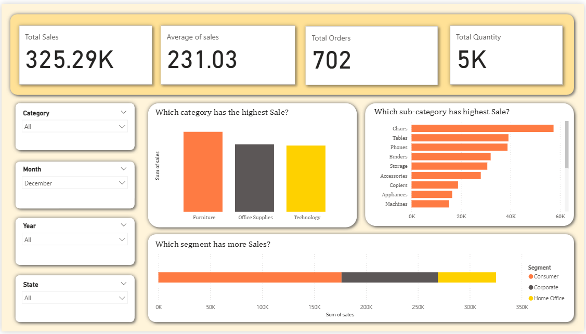
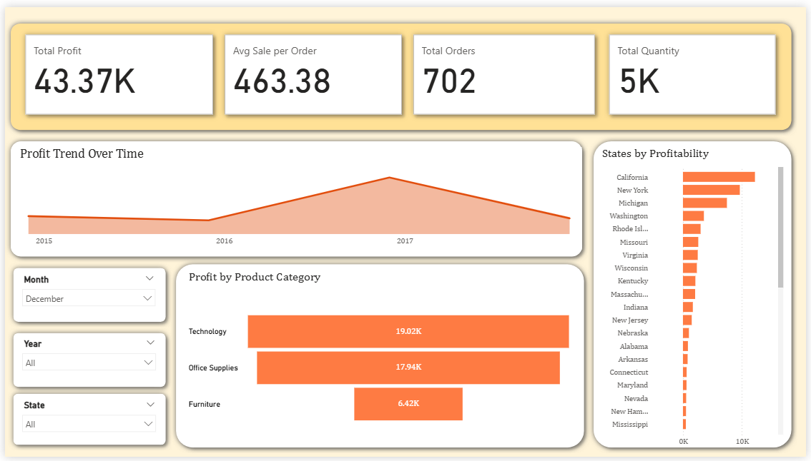

# Superstore Sales Analysis Project

This end-to-end ETL and analytics project focuses on analyzing retail sales data using **Python**, **PostgreSQL**, and **Power BI** to extract insights and visualize trends across product categories, regions, and customer segments.

---

## 🚀 Project Flow

1. **Python (Google Colab)**
   - Cleaned and preprocessed raw Superstore data using pandas.
   - Exported the cleaned dataset as `inspected_superstore.csv`.

2. **PostgreSQL**
   - Imported the cleaned CSV into a PostgreSQL table `superstore`.
   - Wrote SQL queries for KPIs, regional and product analysis, and time-based trends.

3. **Power BI**
   - Connected Power BI to PostgreSQL.
   - Built an interactive dashboard with slicers and charts for business insights.

---

## 🧰 Tech Stack
- Python (`pandas`, `matplotlib`)
- SQL (PostgreSQL)
- Power BI

---

## 📈 Key Insights
- Top 10 products and sub-categories by sales and profit.
- Profitability trends across states and segments.
- Time-based trends using year and month from order date.
- Region-wise sales performance.

---

## 📊 Power BI Dashboard Preview

---

## ✅ Outcomes
- Improved skills in data cleaning and SQL-based analytics.
- Gained experience building professional dashboards.
- Understood business context from raw retail data.

---

## 📘 Learnings
- Data transformation and filtering using pandas.
- Writing SQL queries for aggregations, rankings, and time-based analysis.
- Designing visual dashboards in Power BI.

---

